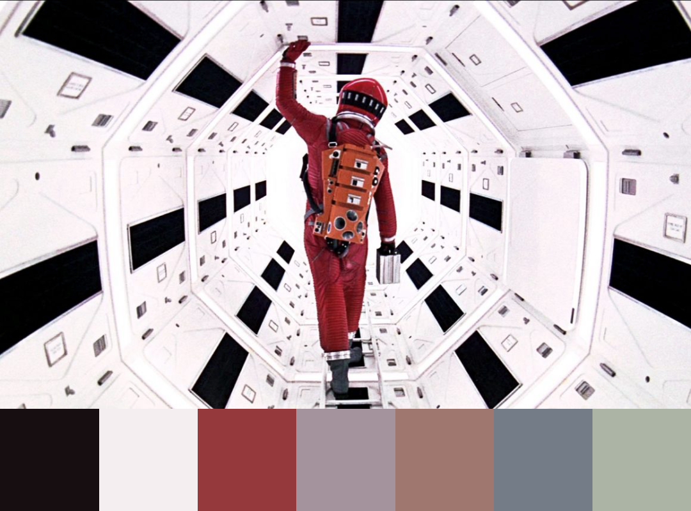

# kaleidoscinema

Adds a color palette of prominent colors to your specified image.

See my [gallery of resulting images](https://www.instagram.com/kaleidoscinema/)

# run locally

> Not currently in NPM, may create a package later

```sh
# Clone the repository
git clone https://github.com/bomkamp/kaleidoscinema.git

# Install dependencies with projen
npx projen

# Run the bin locally
npx ts-node ./src/bin/kaleido.ts <path-to-your-image>.jpg/png/etc.
```

# usage

```sh
$ npx ts-node ./src/bin/kaleido.ts --help

Usage: kaleido [options] <image>

Arguments:
  image                           Path to image file to add a prominent color palette to.

Options:
  -n, --number-colors <number>    Maximum number of colors to add to the palette.
  -h, --height <number>           The Width of the output image.
  -w, --width <number>            The height of the output image.
  -r, --palette-ratio <number>    The amount/ratio of the image that should contain the color palette (0 - 1). E.g. `.2` -> 20% of the final image will be the color palette
  -o, --output-filename <string>  The output filename for the new image.
  --help                          display help for command

Commands:
  help [command]                  display help for command
```

# example

```sh
npx ts-node ./src/bin/kaleido.ts ./2001-before.jpeg -n 7 -r .20 -o 2001-after.png -h 800 -w 1080
```

Before:


After:


